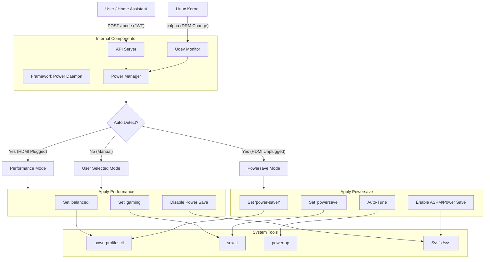

# Framework Power Daemon

A Go daemon to automatically manage power profiles on the Framework Laptop (and others) based on HDMI connectivity.

## Features

- **Automated Power Management**: Switches to "Performance" when HDMI is connected and "Powersave" when disconnected.
- **Udev Monitoring**: Uses Netlink to monitor DRM subsystem changes directly (no external udev rules required).
- **REST API**: Allows manual mode overriding via simple HTTP requests.
- **JWT Authentication**: Secure API access with JSON Web Tokens.
- **Systemd Integration**: Runs effectively as a background service.

## Architecture & Flow

The daemon operates by listening to two main sources of input: Kernel Udev events (for automatic HDMI detection) and HTTP API requests (for manual control).



### How it works
1.  **Monitoring**: The daemon opens a Netlink socket to listen for kernel Udev events. When a DRM (Display) change is detected, it triggers the auto-detection logic.
2.  **API**: It runs an HTTP server to accept manual mode overrides or status checks.
3.  **Actions**: Based on the determined mode, it executes external tools (`powerprofilesctl`, `powertop`, etc.) and writes to `/sys` files to optimize the system.

## Prerequisites

The daemon relies on the following tools:

- `powerprofilesctl`: For changing system power profiles.
- `powertop` (Optional): For auto-tuning power parameters.
- `scxctl` (Optional): For sched-ext scheduler management.

> The original reference shell script is located at `scripts/powermanagement.sh`.

## Installation

### Build from Source

1.  **Clone the repository**:
    ```bash
    git clone https://github.com/yourusername/framework-power.git
    cd framework-power
    ```

2.  **Build**:
    ```bash
    go build ./cmd/framework-powerd
    ```

3.  **Install Binary**:
    ```bash
    sudo cp framework-powerd /usr/local/bin/
    ```

4.  **Install Service**:
    ```bash
    sudo cp configs/systemd/framework-powerd.service /etc/systemd/system/
    sudo systemctl daemon-reload
    sudo systemctl enable --now framework-powerd
    ```

## Usage

### Auto Mode
The daemon starts in auto mode and listens for HDMI events.

### API Control

Trigger modes manually using the REST API (default port 8080).

If JWT authentication is enabled, you must export your token first:
```bash
export TOKEN="your_jwt_token_here"
```

- **Performance**:
  ```bash
  curl -H "Authorization: Bearer $TOKEN" -X POST -d '{"mode":"performance"}' http://localhost:8080/mode
  ```

- **Powersave**:
  ```bash
  curl -H "Authorization: Bearer $TOKEN" -X POST -d '{"mode":"powersave"}' http://localhost:8080/mode
  ```

- **Auto**:
  ```bash
  curl -H "Authorization: Bearer $TOKEN" -X POST -d '{"mode":"auto"}' http://localhost:8080/mode
  ```

- **Status**:
  ```bash
  curl -H "Authorization: Bearer $TOKEN" http://localhost:8080/status
  # Output: {"hdmi_connected":false,"mode":"powersave"}
  ```

### Authentication

To enable JWT authentication, start the daemon with the `--jwt-secret` flag:

```bash
/usr/local/bin/framework-powerd serve --jwt-secret="mysecret"
```

To generate a token:

```bash
/usr/local/bin/framework-powerd token --secret="mysecret"
```

Use the token in your requests:

```bash
export TOKEN=$(/usr/local/bin/framework-powerd token --secret="mysecret")
curl -H "Authorization: Bearer $TOKEN" http://localhost:8080/status
```

## Configuration

You can configure the listening address and port using CLI flags with the `serve` command.

- `--address`: The IP address to listen on (default: `localhost`). Use `0.0.0.0` to listen on all interfaces.
- `--port`: The port to listen on (default: `8080`).

Example:
```bash
/usr/local/bin/framework-powerd serve --address=0.0.0.0 --port=9090
```

> **Note**: If you change the port or address, remember to update your API calls (e.g., `curl`) and Home Assistant configuration accordingly.

## Home Assistant Integration

This project includes a custom component for Home Assistant.

### Installation via HACS

1.  **Add Custom Repository**:
    - Open HACS in Home Assistant.
    - Go to **Integrations** > **three dots (top right)** > **Custom repositories**.
    - Add the URL of this repository: `https://github.com/zaolin/framework-powerd`.
    - Select category: **Integration**.
    - Click **Add**.

2.  **Install**:
    - Find "Framework Power Daemon" in the HACS list.
    - Click **Download**.
    - Restart Home Assistant.

3.  **Restart Home Assistant**:
    Restart HA to load the new component.

4.  **Add Integration**:
    - Go to **Settings > Devices & Services**.
    - Click **Add Integration**.
    - Search for **Framework Power Daemon**.
    - Enter the **Host**, **Port**, and **Token** (if auth is enabled).

### Entities

- **Sensor**: `sensor.framework_power_mode` (Current Mode)
- **Binary Sensor**: `binary_sensor.framework_hdmi` (HDMI Connected)
- **Select**: `select.framework_power_control` (Change Mode)
