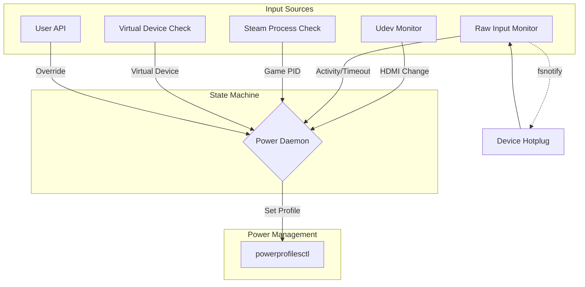
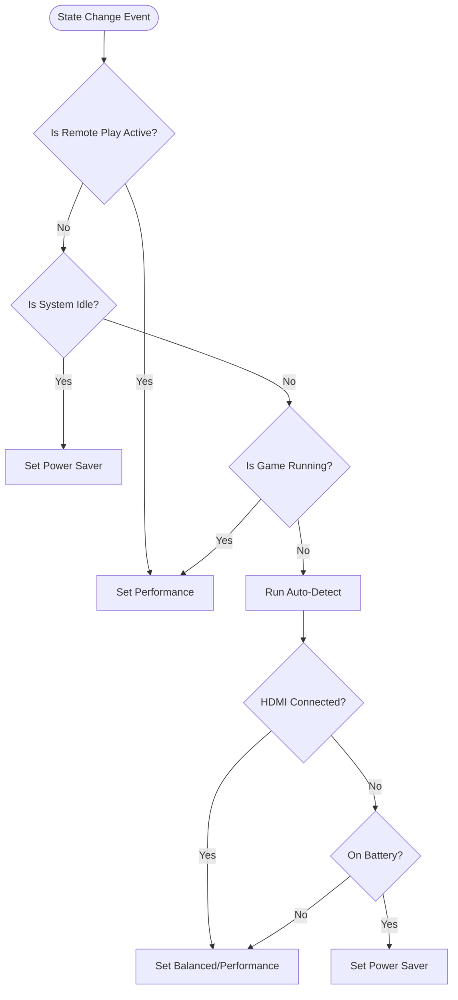

# Framework Power Daemon

A Go daemon to automatically manage power profiles on the **Framework Desktop**, specifically tailored for hybrid setups acting as both a **Steam Gaming Console** and an **AI Server**.

> [!IMPORTANT]
> This daemon is designed for [**Framework Desktop**](https://frame.work/desktop) usage and has been explicitly tested on [**CachyOS**](https://cachyos.org). It ensures the system runs at peak performance when gaming (Active or Remote Play) and drastically reduces power consumption during idle AI server operation (24/7).
>
> **Tip for AI/Ollama Users**: When running local LLMs, using `ollama-vulkan` has been observed to save **~20W/h** compared to `ollama-rocm` on this hardware.

## Features

- **Automated Power Management**: Switches to "Performance" when HDMI is connected and "Powersave" when disconnected.
- **Steam Game Detection**: Automatically switches to "Performance" when a Steam game is running (scanning `/proc` for `SteamAppId`).
- **Steam Remote Play Detection**: Detects active Remote Play streaming sessions by monitoring `/proc/bus/input/devices` for virtual input devices (controllers with empty physical addresses) and forces "Performance" mode.
- **Idle Detection**: Monitors raw input activity on `/dev/input/*` to detect true user inactivity (5-minute timeout) and switches to "Powersave", with specific support for device hotplugging to handle new peripherals.
- **Udev Monitoring**: Uses Netlink to monitor DRM subsystem changes directly (no external udev rules required).
- **REST API**: Allows manual mode overriding via simple HTTP requests.
- **JWT Authentication**: Secure API access with JSON Web Tokens.
- **Systemd Integration**: Runs effectively as a background service.

## Architecture & Flow

The daemon operates by listening to multiple sources of input: Kernel Udev events (HDMI), Input Devices (Activity), Steam Processes, and Virtual Devices (Remote Play).



## Power State Flow

The following flowchart illustrates how the daemon determines which power profile to apply. **Steam Remote Play** takes the highest priority (as it implies active usage without local input), followed by **Idle State**, and then **Game Detection**.



## How it works

1.  **Monitoring**:
    *   **Remote Play**: Polls `/proc/bus/input/devices` to detect virtual controllers created by Steam (identified by empty physical addresses).
    *   **Input**: Monitors `/dev/input/*` devices directly for user activity. Supports hotplugging.
    *   **Steam**: Periodically checks for running Steam games.
    *   **Udev**: Listens for hardware changes (HDMI).
2.  **Decision Making**:
    *   **Priority 1: Remote Play**. If streaming is active (virtual controller found), force **Performance** (overrides idle).
    *   **Priority 2: Idle**. If no local input for 5 minutes, force **Power Saver**.
    *   **Priority 3: Game**. If a game is running (and not idle), force **Performance**.
    *   **Priority 4: Auto**. Otherwise, check HDMI/Power source.
3.  **Action**:
    *   Executes `powerprofilesctl` or similar tools to apply the profile.

## Prerequisites

The daemon relies on the following tools:

- `powerprofilesctl`: For changing system power profiles.
- `powertop` (Optional): For auto-tuning power parameters.
- `scxctl` (Optional): For sched-ext scheduler management.


## Installation

### Build from Source

1.  **Clone the repository**:
    ```bash
    git clone https://github.com/zaolin/framework-powerd.git
    cd framework-powerd
    ```

2.  **Build**:
    ```bash
    go build ./cmd/framework-powerd
    ```

3.  **Install Binary**:
    ```bash
    sudo cp framework-powerd /usr/local/bin/
    ```

4.  **Install Service**:
    ```bash
    sudo cp configs/systemd/framework-powerd.service /etc/systemd/system/
    sudo systemctl daemon-reload
    sudo systemctl enable --now framework-powerd
    ```

## Usage

### Auto Mode
The daemon starts in auto mode and listens for HDMI events.

### API Control

Trigger modes manually using the REST API (default port 8080).

If JWT authentication is enabled, you must export your token first:
```bash
export TOKEN="your_jwt_token_here"
```

- **Performance**:
  ```bash
  curl -H "Authorization: Bearer $TOKEN" -X POST -d '{"mode":"performance"}' http://localhost:8080/mode
  ```

- **Powersave**:
  ```bash
  curl -H "Authorization: Bearer $TOKEN" -X POST -d '{"mode":"powersave"}' http://localhost:8080/mode
  ```

- **Auto**:
  ```bash
  curl -H "Authorization: Bearer $TOKEN" -X POST -d '{"mode":"auto"}' http://localhost:8080/mode
  ```

- **Status**:
  ```bash
  curl -H "Authorization: Bearer $TOKEN" http://localhost:8080/status
  # Output: {"hdmi_connected":false,"mode":"powersave"}
  ```

### Authentication

To enable JWT authentication, start the daemon with the `--jwt-secret` flag:

```bash
/usr/local/bin/framework-powerd serve --jwt-secret="mysecret"
```

To generate a token:

```bash
/usr/local/bin/framework-powerd token --secret="mysecret"
```

Use the token in your requests:

```bash
export TOKEN=$(/usr/local/bin/framework-powerd token --secret="mysecret")
curl -H "Authorization: Bearer $TOKEN" http://localhost:8080/status
```

## Configuration

You can configure the listening address and port using CLI flags with the `serve` command.

- `--address`: The IP address to listen on (default: `localhost`). Use `0.0.0.0` to listen on all interfaces.
- `--port`: The port to listen on (default: `8080`).

Example:
```bash
/usr/local/bin/framework-powerd serve --address=0.0.0.0 --port=9090
```

> **Note**: If you change the port or address, remember to update your API calls (e.g., `curl`) accordingly.


