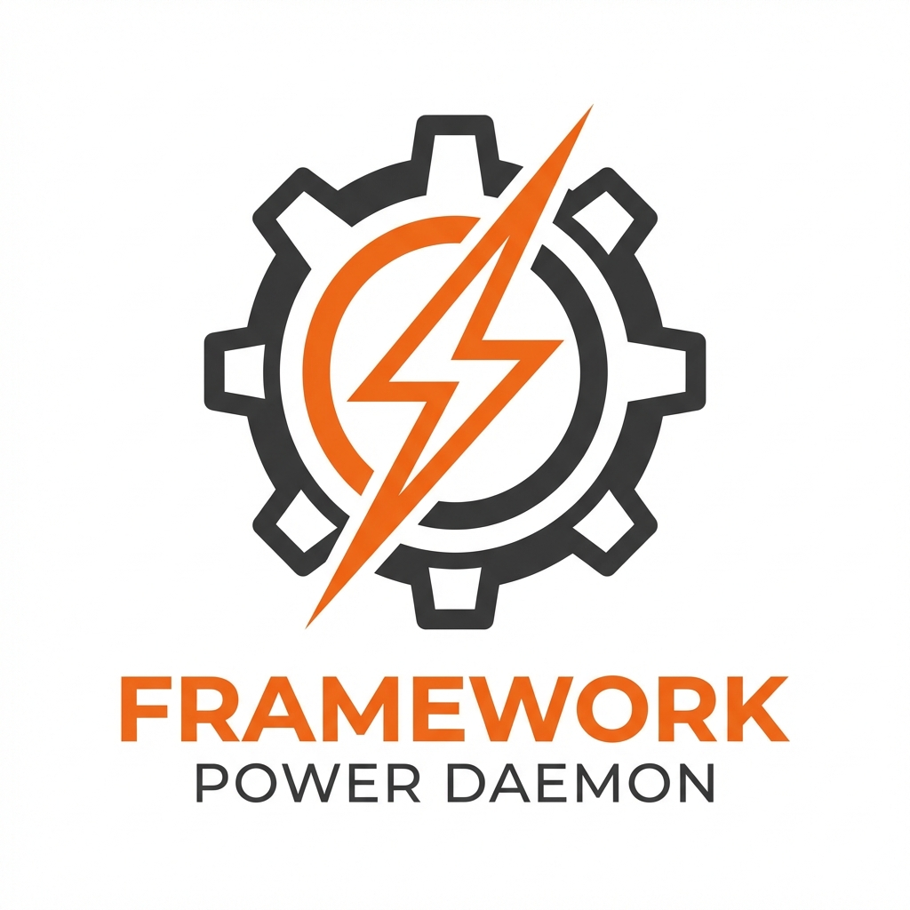
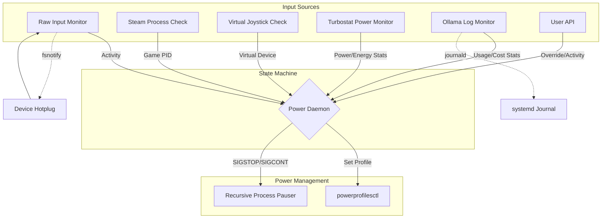
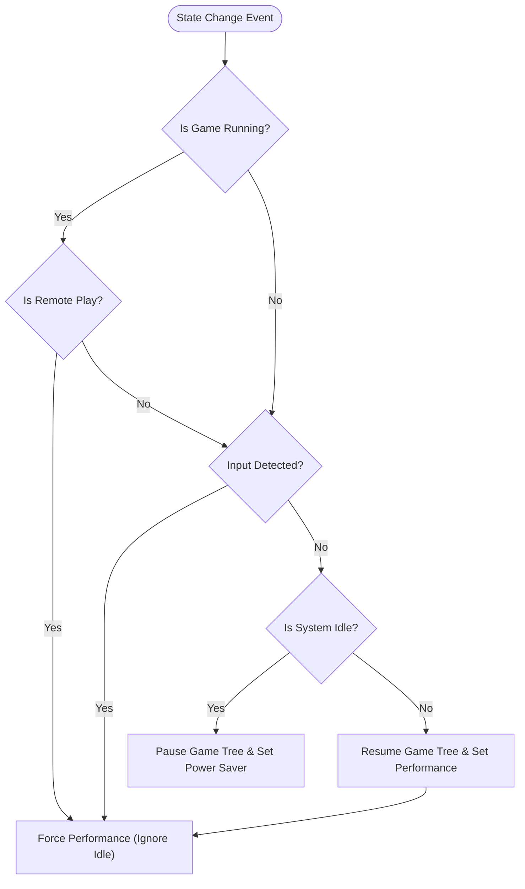

A Go daemon to automatically manage power profiles on the **Framework Desktop**, specifically tailored for hybrid setups acting as both a **Steam Gaming Console** and an **AI Server**.

> [!IMPORTANT]
> This daemon is designed for [**Framework Desktop**](https://frame.work/desktop) usage and has been explicitly tested on [**CachyOS**](https://cachyos.org). It ensures the system runs at peak performance when gaming (Active or Remote Play) and drastically reduces power consumption during idle AI server operation (24/7).
>
> **Tip for AI/Ollama Users**: When running local LLMs, using `ollama-vulkan` has been observed to save **~20W/h** compared to `ollama-rocm` on this hardware.

## Features

- **Automated Power Management**: Switches to "Performance" during active usage (Gaming/Input) and "Powersave" during inactivity.
- **Idle Detection**: Monitors raw input activity (default 5-minute timeout). Support for **Joystick Deadzones** and **Event Deduplication** to prevent drift.
- **Game Pausing**: Recursively pauses the entire process tree of a Steam game (including Proton/Wine wrappers) when idle. **Syncs state** on startup to prevent conflicts.
- **Steam Remote Play Detection**: Detects virtual input devices from Remote Play (specifically `js` interfaces) to keep the system active.
- **Ollama Usage Monitoring**: Tracks API usage per IP/group with cost accounting (energy × €/kWh) via journald log parsing.
- **REST API**: Allows manual mode overriding, idle resetting, and Ollama usage statistics.
- **JWT Authentication**: Secure API access with JSON Web Tokens.
- **Configuration File**: JSON-based daemon configuration.
- **Systemd Integration**: Runs effectively as a background service.

## Architecture & Flow

The daemon operates by listening to multiple sources of input: Kernel Udev events (HDMI), Input Devices (Activity), Steam Processes, and Virtual Devices (Remote Play).



## Power Monitoring

The daemon uses `turbostat` to provide accurate, real-time power consumption metrics.

*   **Source**: `turbostat` (running via `sudo`, reading MSRs).
*   **Metrics**:
    *   **Package**: Total package power.
    *   **Core**: CPU Core power.
    *   **RAM**: Memory power.
*   **Total Energy**: Calculated as the **SUM** of `PkgWatt` + `CorWatt` + `RAMWatt` to account for all reported sensors as requested.
*   **History**: Tracks 24-hour and 7-day rolling energy consumption in **kWh**.

## Network Device Stability

Network devices (Wi-Fi and Ethernet) are explicitly excluded from Runtime Power Management (forced to `on`) to prevent connection drops and instability. This is particularly important for chipsets like the **MediaTek MT7925 (Wi-Fi 7)** which are known to be unstable with `powertop --auto-tune` or aggressive ASPM. The status of these devices can be verified via the `/status` API endpoint.

## Power State Flow

The following flowchart illustrates how the daemon determines which power profile to apply. **Active Gaming** (either Local Input or Remote Play + Running Game) takes priority.



## How it works

1.  **Monitoring**:
    *   **Remote Play**: Polls `/proc/bus/input/devices` to detect virtual joysticks.
    *   **Input**: Monitors `/dev/input/js*` (with deadzone) and valid `/dev/input/event*` devices. Ignores noise and init bursts.
    *   **Steam**: Periodically checks for running Steam games and identifies the "Reaper" root process.

> [!NOTE]
> For a detailed explanation of the idle detection mechanism, including diagrams, see [Idle Detection Logic](docs/idle_logic.md).


2.  **Decision Making**:
    *   **Priority 1: Active Usage**.
        *   **Local Input**: Moving mouse/keyboard/controller -> **Performance**.
        *   **Remote Play**: IF Remote Play is active **AND** a Game is running -> **Performance** (Ignores Idle).
    *   **Priority 2: Idle (No Active Usage)**.
        *   **Action**: Force **Power Saver**. If a game is running, **Recursively Pause It** (targeting `wineserver` or game process, avoiding Steam `reaper`).
3.  **Action**:
    *   Manages Power Profiles and Process States (Running/Stopped).

## Prerequisites

The daemon relies on the following tools:

- `powerprofilesctl`: For changing system power profiles.
- `turbostat`: For accurate power monitoring (usually part of `linux-tools` or `linux-cpupower`).
- `libsystemd-dev`: Required for building (Ollama journald integration uses cgo).
- `powertop` (Optional): For auto-tuning power parameters.
- `scxctl` (Optional): For sched-ext scheduler management.

## Installation

### Build from Source

1.  **Clone the repository**:
    ```bash
    git clone https://github.com/zaolin/framework-powerd.git
    cd framework-powerd
    ```

2.  **Build**:
    ```bash
    go build ./cmd/framework-powerd
    ```

3.  **Install Binary**:
    ```bash
    sudo cp framework-powerd /usr/local/bin/
    ```

4.  **Install Service**:
    ```bash
    sudo cp configs/systemd/framework-powerd.service /etc/systemd/system/
    sudo systemctl daemon-reload
    sudo systemctl enable --now framework-powerd
    ```

## Usage

### CLI Flags

You can customize the daemon's behavior with flags:

```bash
# Debug mode (verbose logs)
framework-powerd serve --debug

# Custom Idle Timeout (default 5m)
framework-powerd serve --idle-timeout 30s
```

### Home Assistant Integration

This project is compatible with [HACS](https://hacs.xyz/) (Home Assistant Community Store).

**Installation via HACS**:
1.  Open **HACS** in Home Assistant.
2.  Click the menu (three dots) in the top right corner and select **Custom repositories**.
3.  Add the repository URL: `https://github.com/zaolin/framework-powerd`.
4.  Select **Integration** as the Category and click **Add**.
5.  Find **Framework Power Daemon** in the list and click **Download**.
6.  Restart Home Assistant.
7.  Go to **Settings > Devices & Services > Add Integration**.
8.  Search for **Framework Power Daemon** and configure it.
    *   **Host**: IP address of the daemon (e.g. `192.168.1.x` or `localhost` if on same machine).
    *   **Port**: `8080` (default).
    *   **JWT Secret**: If you started the daemon with a secret.

**Sensors Provided**:
*   **Power Mode**: `performance` / `powersave`
*   **System Idle**: `True` / `False`
*   **Game Status**: PID and Running/Paused state
*   **Power Usage**: Package, Core, RAM (Watts)
*   **Energy Consumption**: Last 24h & 7 Days (kWh, Sum of Pkg+Cor+RAM)
*   **Uptime**: System uptime (duration)
*   **Polling Interval**: Configurable number entity (seconds)
*   **Ollama Per-Group** (if enabled):
    *   Requests count
    *   Energy consumption (kWh)
    *   Cost (€ or configured currency)

### API Control

Trigger modes manually using the REST API (default port 8080).

If JWT authentication is enabled, you must export your token first:
```bash
export TOKEN="your_jwt_token_here"
```

- **Set Performance**:
  ```bash
  curl -H "Authorization: Bearer $TOKEN" -X POST -d '{"mode":"performance"}' http://localhost:8080/mode
  ```

- **Set Powersave**:
  ```bash
  curl -H "Authorization: Bearer $TOKEN" -X POST -d '{"mode":"powersave"}' http://localhost:8080/mode
  ```

- **Trigger Activity (Reset Idle Timer)**:
  ```bash
  curl -H "Authorization: Bearer $TOKEN" -X POST http://localhost:8080/activity
  ```

- **Get Status**:
  ```bash
  curl -H "Authorization: Bearer $TOKEN" http://localhost:8080/status
  ```

- **Get Ollama Stats** (if enabled):
  ```bash
  curl -H "Authorization: Bearer $TOKEN" http://localhost:8080/ollama/stats
  # Output: {"by_ip":{...},"by_group":{"lan":{"count":5,"total_cost":0.0012},...}}
  ```

### Authentication

To enable JWT authentication, start the daemon with the `--jwt-secret` flag:

```bash
/usr/local/bin/framework-powerd serve --jwt-secret="mysecret"
```

To generate a token:

```bash
/usr/local/bin/framework-powerd token --secret="mysecret"
```

Use the token in your requests:

```bash
export TOKEN=$(/usr/local/bin/framework-powerd token --secret="mysecret")
curl -H "Authorization: Bearer $TOKEN" http://localhost:8080/status
```

## Configuration

The daemon supports a JSON configuration file. Create `/etc/framework-powerd/config.json`:

```json
{
  "server": {
    "address": "0.0.0.0",
    "port": 8080,
    "idle_timeout": "5m"
  },
  "ollama": {
    "enabled": true,
    "service_unit": "ollama.service",
    "groups": [
      {"name": "lan", "cidrs": ["192.168.0.0/16"]},
      {"name": "tailscale", "cidrs": ["100.64.0.0/10"]}
    ]
  },
  "pricing": {
    "energy_price_per_kwh": 0.32,
    "currency": "EUR"
  }
}
```

Run with config:
```bash
/usr/local/bin/framework-powerd serve --config=/etc/framework-powerd/config.json
```

CLI flags override config file values:
- `--address`: The IP address to listen on (default: `localhost`). Use `0.0.0.0` to listen on all interfaces.
- `--port`: The port to listen on (default: `8080`).

> **Note**: If you change the port or address, remember to update your API calls accordingly.

