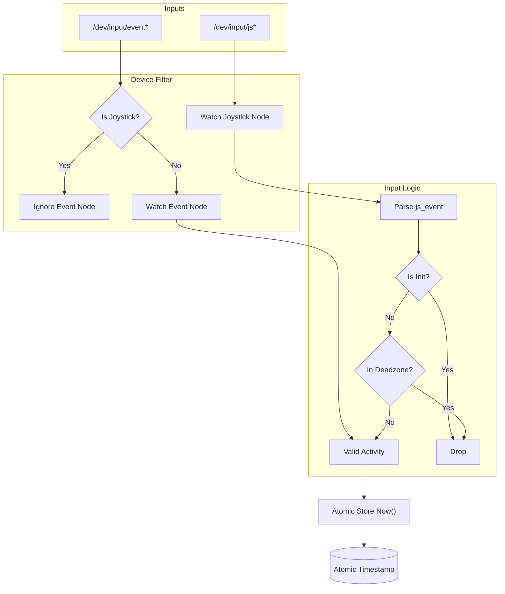

# Idle Detection Logic

This document details the internal working of the `IdleMonitor` component in `framework-powerd`.

## Overview

The `IdleMonitor` determines if the system is "in use" by directly monitoring Linux input devices. Unlike desktop environment idle monitors (which rely on X11/Wayland signals), this daemon reads raw events from `/dev/input/`, making it robust for headless, console, or custom sessions.

## Core Components

### 1. Device Discovery & Deduplication

The monitor discovers input devices in three ways:

1.  **Initial Scan**: On startup, it glob searches for `/dev/input/event*` and `/dev/input/js*`.
2.  **Hotplug Detection**: It uses `fsnotify` to watch the `/dev/input` directory.
3.  **Manual Registration**: The `RemotePlayDetector` explicitly registers virtual devices used by Steam Remote Play.

**Deduplication Strategy**:
Gamepads often appear as both generic `event*` devices and specialized `js*` devices. To prevent double-counting inputs (and doubling log noise):
*   The monitor checks `/sys/class/input/eventX/device/handlers`.
*   If an `event*` device claims to be a joystick (has `js` handler), it is **ignored**.
*   The monitor relies solely on the corresponding `js*` interface for that device, which allows for better event parsing.

### 2. Activity Monitoring (`watchDevice`)

For every watched device, a lightweight Goroutine is spawned:

*   **Mechanism**: It performs a blocking read on the device file.
*   **Buffer Size**: Reads 64 bytes to accommodate full `input_event` (24 bytes) or `js_event` (8 bytes) structures.
*   **Noise Filtering**:
    *   **Init Events**: For `js*` devices, initialization bursts (Flag `0x80`) are ignored to prevent "fake" activity on connection.
    *   **Deadzone**: For `js*` axes, values between -4000 and 4000 (~12%) are ignored to filter out stick drift.
*   **Action**: If valid input > threshold, it updates the global `lastActivity` atomic timestamp.

### 3. State Machine (`runTicker`)

A separate Goroutine runs a ticker every **1 second**:

1.  **Calculate Duration**: `timeSinceLastActivity = Now - lastActivity`.
2.  **Check Timeout**: Compare against the configured timeout (default: 5 minutes, configurable via `--idle-timeout`).
3.  **Transitions**:
    *   **Active -> Idle**: If duration > timeout. Triggers `onIdle()` (Pauses games recursively, sets Power Saver).
    *   **Idle -> Active**: If duration < timeout. Triggers `onActive()` (Resumes games, sets Performance).

## Flow of Control

## Troubleshooting

-   **"Never Idle"**: Usually caused by joystick drift or init bursts. The current logic filters these out.
-   **Double Logs**: Caused by monitoring both event and js nodes for the same gamepad. The deduplication logic fixes this.
-   **Debug Mode**: Run with `--debug` to see exactly which devices are ignored or active.
